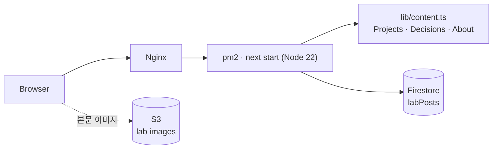
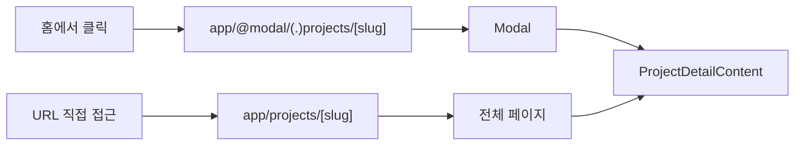
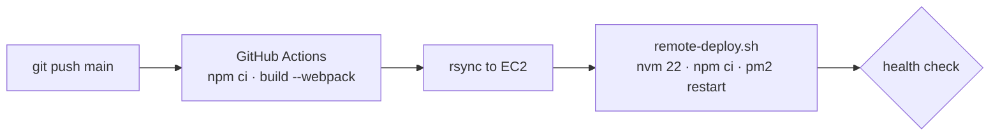

# daegom.dev

윤대현의 포트폴리오 사이트입니다. **https://daegom.dev**

프로젝트에서 무엇을 맡았고 어떤 결과가 있었는지, 그 과정의 판단과 학습 기록을 한곳에서 확인할 수 있게 만들었습니다.

## 구성

| 섹션 | 내용 | 데이터 |
|---|---|---|
| Projects | 참여한 프로젝트, 담당한 기능, 성과. 클릭하면 모달로 열림 | `lib/content.ts` |
| Decisions | 프로젝트 안에서 내린 판단의 기록 | `lib/content.ts` |
| Lab | 공부하고 실험한 글 (Velog·Notion에서 이전) | Firestore + S3 |
| About | 기술 스택, 학력, 활동 | `lib/content.ts` |

## 아키텍처



Projects와 Decisions는 코드에 두었고, 글이 많은 Lab만 Firestore에서 읽습니다.

`/lab`은 분류·페이지를 검색 파라미터로 받아 서버에서 렌더링합니다. 목록이 클라이언트에서만 그려지면 JS 없이 열어본 크롤러나 링크 미리보기에 빈 페이지로 보이기 때문입니다. 검색 파라미터를 읽는 페이지는 세그먼트의 `revalidate`가 적용되지 않으므로, Firestore 조회 자체를 `unstable_cache(revalidate: 3600)`로 감싸 요청마다 119건을 다시 읽지 않게 했습니다.

### 모달 라우팅

프로젝트 상세는 홈에서 클릭하면 모달로, URL로 직접 들어오면 전체 페이지로 열립니다. Next.js의 Intercepting Route로 같은 콘텐츠 컴포넌트를 재사용합니다.



이 구조는 서버 렌더링이 필요해서 정적 export를 쓸 수 없습니다. 그래서 `next start`를 상시 실행하는 Node 서버에 배포합니다.

### 배포

`main`에 push하면 자동으로 배포됩니다.



## 기술 스택

Next.js 16 (App Router) · React 19 · TypeScript · Tailwind CSS v4
Firebase Admin (Firestore) · AWS S3 · AWS EC2 · Nginx · pm2 · GitHub Actions

## 프로젝트 구조

```text
app/
  page.tsx              홈 (Projects · Lab · About)
  projects/[slug]/      프로젝트 상세 (전체 페이지)
  decisions/[slug]/     결정 기록 상세
  lab/                  Lab 목록 · 상세
  @modal/               가로채기 라우트 (모달)
components/             Modal · DetailSections · Nav 등
lib/
  content.ts            Projects · Decisions · About 데이터
  lab.ts                Firestore에서 Lab 글 조회
  metadata.ts           페이지별 제목·설명·OG 이미지 구성
deploy/                 nginx 설정 · 원격 배포 스크립트
```

## 로컬 실행

```bash
npm install
npm run dev
```

홈의 Lab 목록과 `/lab`이 Firestore에서 글을 읽으므로 `.env.local`이 필요합니다.

| 변수 | 설명 |
|---|---|
| `FIREBASE_PROJECT_ID` | Firebase 프로젝트 ID |
| `FIREBASE_CLIENT_EMAIL` | 서비스 계정 이메일 |
| `FIREBASE_PRIVATE_KEY` | 서비스 계정 비공개 키 (줄바꿈은 `\n`) |

## 만들면서 겪은 문제

배포 직후 `/lab`이 500을 냈고, 원인은 세 겹이었습니다.

| 증상 | 원인 | 해결 |
|---|---|---|
| `Cannot find package 'firebase-admin-<hash>'` | Turbopack 프로덕션 빌드가 외부 패키지 이름에 해시를 붙여 런타임에서 찾지 못함 | `next build --webpack`으로 고정 |
| 같은 오류가 Node 20에서 재현 | `firebase-admin@14`가 Node 22 이상을 요구하고, 미달이면 하위 의존성이 조용히 빠짐 | 배포 스크립트에서 Node 22를 강제하고 미달 시 실패 처리 |
| pm2 cluster에서 500 | cluster 워커에서 해시 임포트가 깨짐 | fork 모드 1개 인스턴스로 고정 |

배포 절차 전체는 [deploy/README.md](deploy/README.md)에 있습니다.
